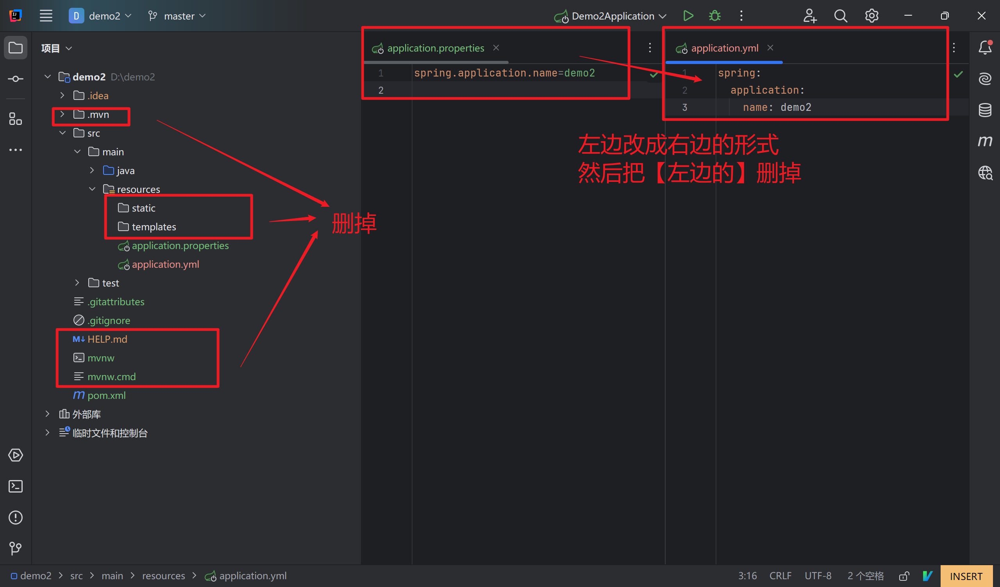
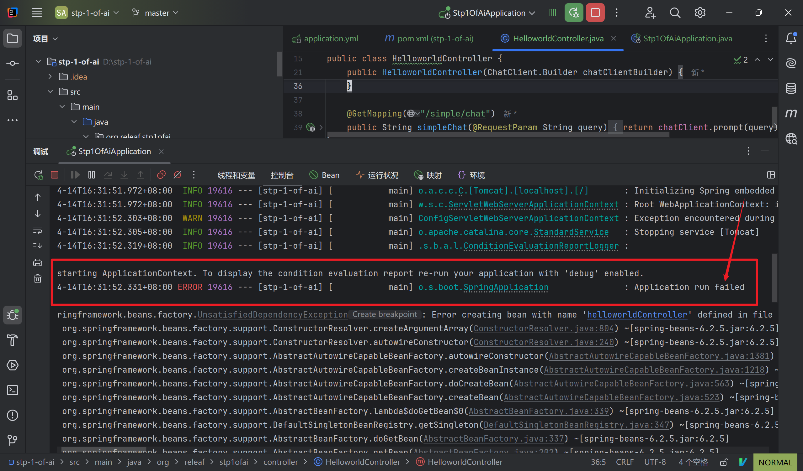
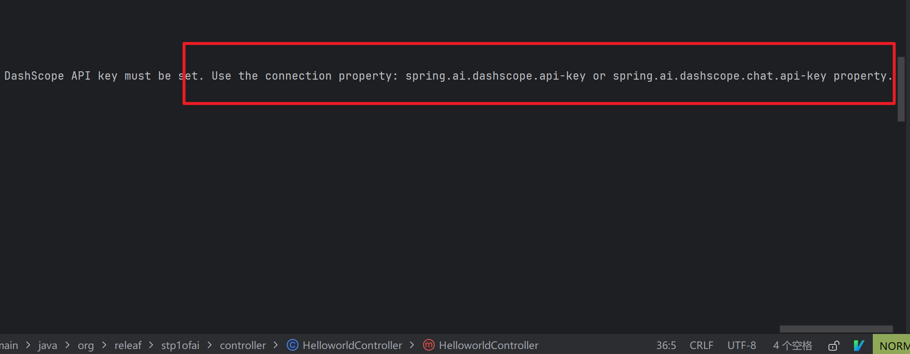
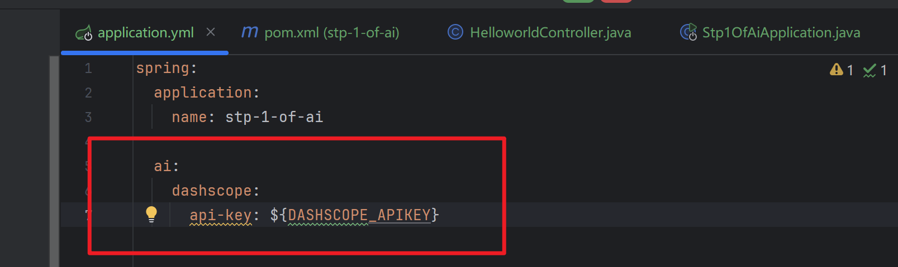
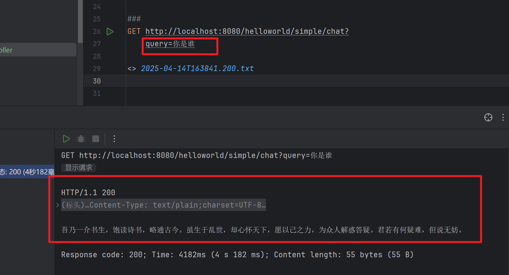

## 一、创建 Spring Boot 项目  

- 在 Idea 中新建 Spring Boot 项目，选好 “Web” 依赖  

- 删除：初始创建时的各种形似`.mvn` 的东西，以及resources 文件夹下除了 application.properties 的东西   

- 创建：properties 文件不太方便阅读，改为 yml 文件好一些  

- 所有的步骤总和就是下面这个样子

  

## 二、导入依赖  

- 在 `pom.xml` 中添加如下内容：

  ```xml
  <dependency>
    <groupId>com.alibaba.cloud.ai</groupId>
    <artifactId>spring-ai-alibaba-starter</artifactId>
    <version>1.0.0-M5.1</version>
  </dependency>
  ```

  - 目前还需要添加这个：

  ```xml
  <repositories>
    <repository>
      <id>spring-milestones</id>
      <name>Spring Milestones</name>
      <url>https://repo.spring.io/milestone</url>
      <snapshots>
        <enabled>false</enabled>
      </snapshots>
    </repository>
  </repositories>
  ```

  这是由于 spring-ai 相关依赖包还没有发布到中央仓库，可能会出现 spring-ai-core 等相关依赖解析问题  

## 三、Controller  

我们创建一个 `HelloworldController吧`

```java
@RestController  
@RequestMapping("/helloworld")  
public class HelloworldController {  
  
    private static final String DEFAULT_PROMPT = "你是一个古代人，请你根据用户的输入进行回答";  
  
    private final ChatClient chatClient;  
  
    public HelloworldController(ChatClient.Builder chatClientBuilder) {  
        this.chatClient = chatClientBuilder  
                .defaultSystem(DEFAULT_PROMPT)  
                .defaultAdvisors(  
                        new MessageChatMemoryAdvisor(new InMemoryChatMemory())  
                )  
                .defaultAdvisors(  
                        new SimpleLoggerAdvisor()  
                )  
                .defaultOptions(  
                        DashScopeChatOptions.builder()  
                                .withTopP(0.7)  
                                .build()  
                )  
                .build();  
    }  
  
    @GetMapping("/simple/chat")  
    public String simpleChat(@RequestParam String query){  
        return chatClient.prompt(query).call().content();  
    }  
}
```


## 四、报错了！

尝试运行起来吧，但是没想到竟然报错了，这可是跟着官方文档走的，这可怎么办  



### 解决  

其实报错条目拖到最后面就可以看到，我们少配置了东西：  

  

在 `application.yml` 中添加如下内容，记得注意缩进：

```xml
spring:
  application:
    name: stp-1-of-ai
# 添加如下内容：
  ai:
    dashscope:
      api-key: ${DASHSCOPE_APIKEY}
```



## 五、运行成功  

好了，没问题了，我们和古代人对上话了  


