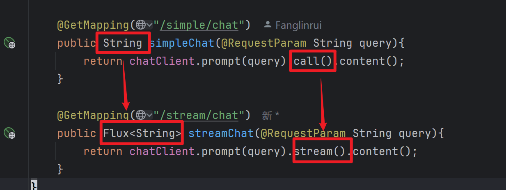
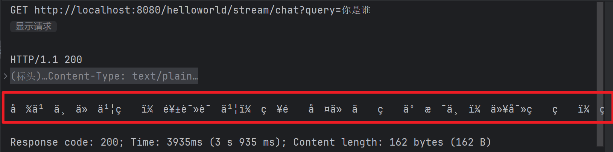
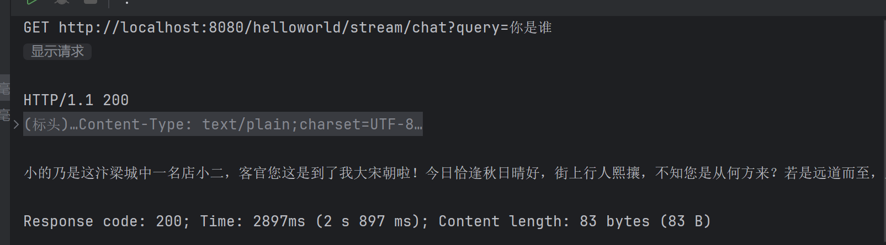

## 流式调用  

我们用常见的网页版AI的时候，有字一个一个出现的“打字机”效果，这是通过 **流式调用**的方法做到的  

*关于流式调用，请移步 02.1_WebFlux 与 SSE*

### 1. 具体实现：

相对常规调用，我们只需要改变返回值，以及调用  `stream()` 方法 来替代原本的 `call()` 就可以了，其他不变，更具体的来说：

- 返回值：`String -> Flux<String>`  
- 调用方法：`chatClient.prompt(query)`***.call()***`.content()` -> `chatClient.prompt(query)`***.stream()***`.content`   

如下：  

  

  

### 2. 乱码问题及解决  

然而，出现了乱码问题：

  


很明显，只需要设置一下 `response` 对象的编码类型即可，这需要我们在参数中传入 `HttpServletResponse` 类型的 `response`，并显式设置编码类型

```java
 response.setCharacterEncoding("UTF-8");
```


没问题了：

  

具体的实现如下：

```java  
@GetMapping("/stream/chat")
public Flux<String> streamChat(@RequestParam String query, HttpServletResponse response){
    response.setCharacterEncoding("UTF-8");
    return chatClient.prompt(query).stream().content();
}
```


