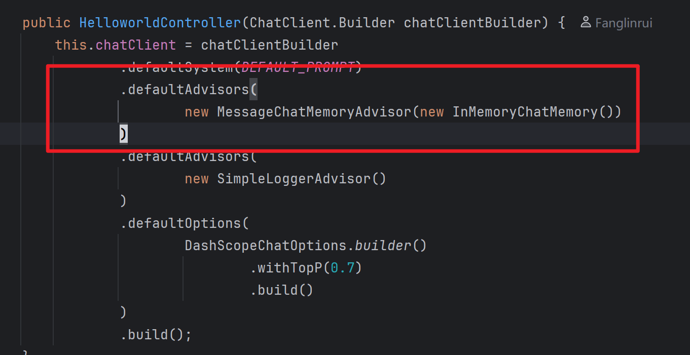
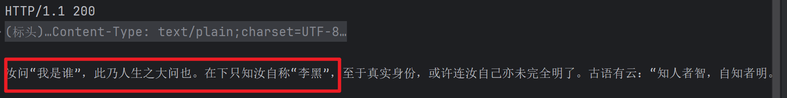

## 一、会话记忆  

我们在前面的这里构造时已经加入了会话记忆的功能，

  

可是后面会发现，并没有记忆，应该如何解决呢？  

原来是在调用 `chatClient` 时，需要传入 `id` 来启用对应的功能，如下：  

```java
// 在使用 Chat Memory 时，需要指定对话 ID，以便 Spring AI 处理上下文。
@GetMapping("/advisor/chat/{id}")
public Flux<String> advisorChat(
        HttpServletResponse response,
        @PathVariable String id,
        @RequestParam String query ) {
    response.setCharacterEncoding("UTF-8");

    return this.chatClient.prompt(query)
            .advisors(
                    advisor -> advisor
                            .param(CHAT_MEMORY_CONVERSATION_ID_KEY,id)
                            .param(CHAT_MEMORY_RETRIEVE_SIZE_KEY,100)
            ).stream().content();
}
```


结果如下：

  


## 二、总结  

可以通过 Advisor 来增强功能、方便开发  

> 根据 Spring AI 文档，Advisor 的主要优势包括封装重复出现的生成式 AI 模式、转换发送到和从大型语言模型（LLMs）的数据，以及提供跨各种模型和用例的可移植性。  

- Spring AI 官方文档中的例子如下：
```java
var chatClient = ChatClient.builder(chatModel)
    .defaultAdvisors(
        new MessageChatMemoryAdvisor(chatMemory), // chat-memory advisor
        new QuestionAnswerAdvisor(vectorStore)    // RAG advisor
    )
    .build();

String response = this.chatClient.prompt()
    // Set advisor parameters at runtime
    .advisors(advisor -> advisor.param("chat_memory_conversation_id", "678")
            .param("chat_memory_response_size", 100))
    .user(userText)
    .call()
	.content();
```


