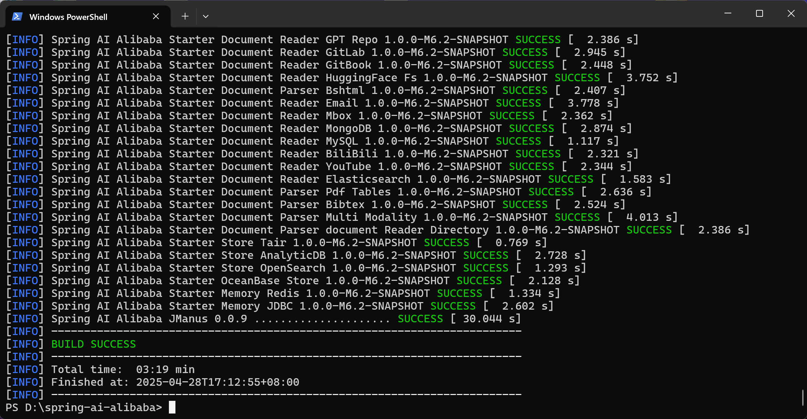

> 注意，从 Spring AI M7 版本开始，提供了四种会话记忆的实现：`InMemoryChatMemory`, `CassandraChatMemory`, `Neo4jChatMemory`, 以及 `JdbcChatMemory`  

## 1. 为什么要单开这样一个“会话记忆持久化”目录  

- 参考 `spring-ai-alibaba-chat-memory-example` 的 README：
> 1. Spring AI 提供了基于内存的 InMemory 实现； 
> 2. Spring AI Alibaba 提供了基于 Redis 和 JDBC 的 ChatMemory 实现。  

于是，想看看具体是怎么实现的  

## 2. 前期准备  

还是 README 中的：
> 包含此依赖的 Spring AI Alibaba 版本尚未发布，如果需要体验此 Demo，需要本地 install。

### 我踩的坑：  
使用 IDEA 内置的 Maven 并没法安装，只会跳“找不到符号”这个问题：

  

解决方法：【通过使用本地的 maven 进行安装】：

```bash
mvn clean install -DskipTests
```

结果如下：



