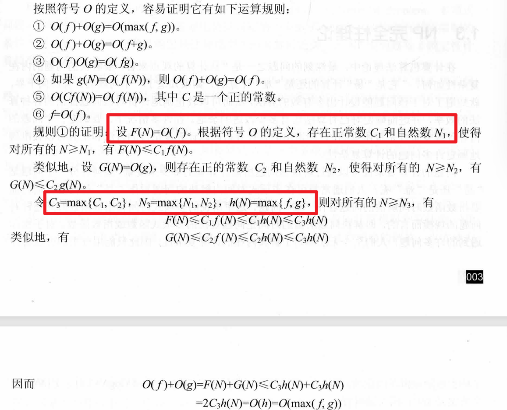

# 1 算法概述  

## 1.1 算法复杂性  

题型：首先要求你默写出某个的定义；然后给出一个函数，证明上下界  

### 1.1.1 渐进分析的符号  

1. 渐进上界O $存在正常数c和n_0,使得对所有n\ge n_0有 0\le f(n)\le cg(n)$  

2. 渐进下界$\Omega$ $存在正常数c和n_0，使得对所有n\ge n_0有0\le cg(n)\le f(n)$  

3. 非紧上界记号o $对于任何正常数c\gt0,存在正数n_0\gt 0使得对所有的n\ge n_0有 0\le f(n) \lt cg(n)$

   等价于f(n)/g(n) → c，as n→$\infty$  

4. 非紧下界记号$\omega$  $对于任何正常数c\gt0,存在正数n_0\gt 0使得对所有的n\ge n_0有 0\le cg(n) \lt f(n)$  

   等价于f(n)/g(n)→$\infty$ , as n→$\infty$  

   $f(n) \in \omega(g(n)) \Leftrightarrow g(n)\in o(f(n))$

5. 紧渐进界记号$\Theta$  ，1、2都满足 $存在正常数c_1,c_2和n_0使得对所有n\ge n_0 有 c_1g(n)\le f(n)\le c_2g(n)$​  

### 1.1.2 证明上下界  

- 直观上来说，就是放缩法
- 直接把后面的都取成最高阶的  

### 1.1.3 证明定理  

比如，要求你证明$O(f(n)g(n))=O(f(n))O(g(n))$  

- 首先根据定义，设出$c_1,n_1,c_2,n_2$  
- 取$c_3=c_1 * c_2$, $n_3=max\{n1,n2\}$  
- 取定义中的式子，带入上面得到的量  
- 证明完成  


另一个例子（课本上的）：



# 2 递归与分治  

## 2.1 用特征方程解递归方程的通解  

1. 拿到特征方程  $r^2=?r+?$
2. 解特征方程（二次方程）的根  $r_1,r_2$
3. 通解$x_n = c_1 r_1^n +c_2 r_2^n$  
4. 初值条件带入，进行求解  
5. 得到$c_1,c_2$  
6. 将上一步所得带入通解当中，即可  

### 2.2 算法  

#### 2.2.1 合并排序  

##### **算法思想**  

将待排序元素分成大小大致相同的两个子集合，分别对两个子集合进行排序，最终将排好的子集合合并成要求的排好序的集合  

##### 源代码  

- MergeSort

```cpp
template<class Type>
void MergeSort(Type a[], int left, int right){
    if (left < right ){
        int i = (left+right)/2;
        MergeSort(a,left i);
        MergeSort(a,i+1,right);
        Merge(a,b,left,i,right);
        Copy(a, b, left, right);
    }
}
```

- Merge

```cpp
void Merge(Type c[], Type d[], int l, int m, int r){//合并c[l:m]，c[m+1,r]到d[l:r]
    int i = l, j= m+1, k =l;
    while((i<=m) && (j<=r)){
        if (c[i] <= c[j])
            d[k++] = c[i++];
        else
            d[k++] = c[j++];
    }
    if (i>m){
        for (int q=j;q<=r;q++)
            d[k++]=c[q];
    }
    else{
        for (int q=i;q<=m;q++)
            d[k++]=c[q]
    }
    
}
```


##### 复杂度  

$O(n\log n)$

#### 2.2.3 快速排序  

##### 算法思想  

对于输入的子数组 a[p:r], 按照以下三个步骤进行排序。  

1. 分解：以 a[p] 为基准元素将 a[p:r] 划分成三段 a[p:q-1], a[q] , a[q+1:r]，使得 a[q] 左边的段中的都比它小，右边的段中的都比它大  
2. 递归：对左右两边的调用快排  
3. 合并：由于排序是就地进行的，所以左右两边排好，也即是整体排好  

##### 源代码  

- QuickSort  

```cpp
template<class Type>
void QuickSort(Type a[], int p, int r){
    if (p<r){
        int q = Partition(a,p,r);
        QuickSort(a,p,q-1);
        QuickSort(a,q+1,r);
    }
}
```

- Partition

```cpp
template<class Type>
int Partition(Type a[],int p, int r){
    int i =p, j= r+1;
    Type x = a[p]; 
    //大于x放左边，小于x放右边
    while (true){
        while(a[++i]<x && i<r) ;
        while(a[--j]>x) ;
        if (i>=j)
            break;
        Swap(a[i],a[j]);
    }
    a[p]=a[j]; //两个指针相交的位置就是出的序号，和开头换换
    a[j]=x;
    return j;
}
```

- RandomizedPartition

```cpp
int RandominzedPartiton(Type a[], int p, int r){
    int i = Random(p,r);
    Swap(a[i],a[p]);
    return Partition(a,p,r); //其实就是选了个随机位置与首位交换，其他不变
}
```

##### 复杂度

- 最坏情况下，有：

$$
T(n)=
\begin{cases}
O(1) & \quad n\leqslant1 \\
T(n-1)+O(n) & \quad n>1 & 
\end{cases}
$$

​	此时复杂度为$O(n^2)$  

- 最好情况下，有：

$$
T(n)=\begin{cases}O(1)&\quad n\leqslant1\\2T(n/2)+O(n)&\quad n>1&\end{cases}
$$

​	此时复杂度为$O(n\log n)$  

#### 2.2.4 线性时间选择  

##### 源代码  

- RandomizedSelect  

```cpp
template<class Type>
Type RandommizedSelect(Type a[], int p, int r, int k){
    if (p==r)
        return a[p];
    int i = RandomizedPartition(a,p,r), j =i-p+1;//前半的个数
    if (k<=j)
        return RandomizedSelect(a,p,i,k);
    else 
        return RandomizedSelect(a,i+1,r,k-j);
}
```

- Select

```cpp
template<class Type>
Type Select(Type a[], int p ,int r, int k){
    if (r-p < 75){
        直接排序;
        return a[p+k-1];
    }
    for (int i=0; i<= (r-p-4)/5;i++){
        将a[p+5*i]至a[p+5*i+4]的第3小的元素与a[p+i]交换位置;
    }
    Type x = Select(a,p,p+(r-p-4)/5),(r-p-4)/10); //中位数的中位数
    int i = Paritition(a,p,r,x), j = i-p+1;
    if (k <= j)
        return Select(a,p,i,k);
    else 
        return Select(a,i+1,r,k-j);
}
```

##### 复杂度  

$O(n)$

# 3 动态规划  

最长公共子序列 最大子段和 01背包问题 矩阵连乘问题  

### 3.1 01背包问题  

#### 递归关系  

$$\begin{aligned}m(i,j)&=\begin{cases}\max\{m(i+1,j),m(i+1,j-w_i)+\nu_i\}&\quad j\geqslant w_i\\m(i+1,j)&\quad0\leqslant j\leqslant w_i&\end{cases}\\&m(n,j)=\begin{cases}\nu_n&\quad j\geqslant w_n\\0&\quad0\leqslant j<w_n&\end{cases}\end{aligned}$$  

其中：

- 第一个式子中，如果能装，就判断装/不装哪个价值更大；如果不能装，就根之前的价值一样  
- 第二个式子用于初始化，表示对最后一个物品能装那么每个都装一个；不能装就是0  

#### 源代码  

- v 表示价值，w表示重量，c表示背包容量，n表示总个数，m表示可选i,i+1,...n物品，容量为j时的最大价值

- Knapsack  ——算最大值

```cpp
template<class Type>
void Knapsack(Type v, int w, int c, int n, Type** m){
    //初始化，-1就是最大的装不下的地方
    int jMax = min(w[n]-1,c);
    for (int j=0;j<=jMax;j++)
        m[n][j] = 0;
    for (int j=w[n];j<=c;j++)
        m[n][j]=v[n];
    //为n时已经弄好了，递归就能做了
    for (int i = n-1;i>1;i--){
        jMax=min(w[i]-1,c);
        for (int j =0;j<=jMax; j++)
            m[i][j]=m[i+1][j];
        for (int j = w[i]; j <=c; j++)
            m[i][j]=max(m[i+1][j], m[i+1][j-w[i]]+v[i])
    }
    m[1][c]=m[2][c];
    if (c >= w[i])
        m[1][c]=max(m[1][c], m[2][c-w[1]]+v[1]);
    //针对上面三行，为什么不用循环了？因为只要最后一个结果就好了
    
}
```

- Traceback——算具体组合  
- 其中x是数组，表明具体情况是装还是不装

```cpp
void Traceback(Type **m, int w, int c ,int n ,int x){
    for (int i = 1;i<n;i++){
        if (m[i][c]==m[i+1][c])
            x[i]=0;//没装
        else{
            x[i]=1;
            c -= w[i];
        }
    }
    x[n] = (m[n][c]) ? 1:0;
}
```

#### 复杂度  

- Knapsack: $O(nc)$  
- Backtrace: $O(n)$​  

### 3.2 矩阵连乘问题  

#### 递归关系  

$$
m[i][j]=\begin{cases}0&\quad i=j\\\min_{i\leqslant k<j}\left\{m[i][k]+m[k+1][j]+p_{i-1}p_kp_j\right\}&\quad i<j&\end{cases}
$$

- 其中，A[k]的列数用 $p_k$ 表示，则 A[i] 的行数= A[i-1] 的列数 = $p_{i-1}$  

#### 源代码  

- MatrixChain  
- 其中 m 记录乘的结果； s 记录分割的位置

```cpp
void MatrixChain(int *p, int n, int **m, int **s){
    for (int i =1;i<=n;i++) m[i][i] = 0;
    for (int r =2; r<=n; r++)// r为连乘矩阵的数量  
        for (int i =1; i<= n-r+1; i++){
            //初始化
            int j=i+r-1;
            m[i][j] = m[i+1][j] + p[i-1]*p[i]*p[j];
            s[i][j] = i;
            for (int k = i+1;k< j; k++){
                int t = m[i][k]+ m[k+1][j]+ p[i-1]*p[k]*p[j];
                if (t < m[i][j]){ m[i][j]=t;s[i][j] =k; }
            }
        }
}
```

- TraceBack  

```cpp
void Traceback(int i, int j, int **s){
    if (i ==j) return;
    Traceback(i, s[i][j], s);
    Traceback(s[i][j]+1, j ,s);
    cout<<"Multiply A "<<i<<"," <<s[i][j];
    cout<<" and A "(s[i][j]+1)<<", "<<j<<endl;
}
```

以分割点为界，左右分别递归调用即可

#### 复杂度  

$O(n^3)$

### 3.3 最长公共子序列问题  

#### 递归关系  

$$
c[i][j]=\begin{cases}0&i>0;j=0\\c[i-1][j-1]+1&i,j>0;x_i=y_i\\\max\{c[i][j-1],c[i-1][j]\}&i,j>0;x_i\neq y_i&\end{cases}
$$

- 其中，$c[i][j]$记录 $X_i,Y_j$的最长公共子序列的长度

#### 源代码  

- LCSLength——算长度  

```cpp
void LCSLength(int m, int n, char *x, char *y, int **c, int **b){
    int i, j;
    for(i=1; i<=m; i++)
        c[i][0]=0;
    for(i =1;i<=n; i++)
        c[0][i]=0;
    for(i=1; i<=m; i++){
        for(j=1; i<=n; j++){
            if (x[i]==y[j]){
                c[i][j] = c[i-1][j-1]+1;
                b[i][j] = 1;
            }
            else if (c[i-1][j]>=c[i][j-1]){
                c[i][j] = c[i-1][j];
                b[i][j] = 2;
            }
            else {
                c[i][j] = c[i][j-1];
                b[i][j] = 3;
            }
        }
    }
}
```

- LCS——构造  

```cpp
void LCS(int i, int j, char* x, int **b){
    if (i==0||j==0) return;
    if (b[i][j]==1){
        LCS(i-1, j-1, x, b);
        cout<<x[i];
    }
    else if (b[i][j]==2)
        LCS(i-1, j ,x, b);
    else 
        LCS(i, j-1, x, b);
}
```

#### 复杂度 

第一个 $O(mn)$  

第二个 $O(m+n)$  

### 3.4 最大子段和问题  

#### 递归关系  

$b[j]=max\{b[j-1]+a[j],a[j]\} \space 1\le j\le n$

#### 源代码  

- MaxSum  
- 为负的时候，遇到正的不如直接换成正的

```cpp
int MaxSum(int n, int *a){
    int sum =0, b=0;
    for (int i=1;i<=n;i++){
        if (b>0)
            b+=a[i];
        else
            b=a[i];
        if(b>sum)
            sum=b;
    }
    return sum;
}
```

#### 复杂度  

时间和空间各$O(n)$

# 4 贪心算法  

活动安排、背包问题、哈夫曼编码、最小生成树、单源最短路径（ 迪杰斯特拉）

说明贪心过程，具体问题，复杂度，证明  

装载：先装最轻的

## 4.1 活动安排  

### 贪心过程  

总是选择具有最早完成时间的相容活动；使剩余的可安排时间极大化  

### 源代码  

- s表明开始时间，f表明结束时间，A表明选哪些

```cpp
template<class Type>
void GreedySelector(int n, Type s[], Type f[], bool A[]){
    A[1] = true;
    int j = 1;
    for (int i =2;i<=n;i++){
        if (s[i]>=f[j]){
            A[i] = true;
            j = i;
        }
        else 
            A[i] = false;
    }
}
```

### 复杂度  

$O(nlogn)$

## 4.2 背包  

### 贪心思想  

首先计算每种物品单位重量的价值，然后依照贪心选择策略，将尽可能多的单位重量价值最高的物品装入背包；

### 源代码  

```cpp
void Knapsack(int n, float M, float v[], float w[], float x[]){
    Sort(n, v, w);
    int i;
    for (i=1;i<=n;i++)
        x[i] = 0;
    float c =M;
    for (i=1;i<=n;i++){
        if (w[i]>c)
            break;
        x[i]=1;
        c -=w[i];
    }
    if (i<=n)
        x[i]=c/w[i];
}
```

### 复杂度  

$O(n \log n)$  

## 4.3 哈夫曼编码  

### 贪心思路  

每次取最小的两个合并，再插入队列；有树后左0右1  

### 源代码  

```cpp
MinHeap<Huffman<type>>Q(1); //建立优先队列  
Q.Initialize(w,n,n);
//反复合并最小俩  
Huffman<Type>x, y;
for(int i =1;i<n;i++){
    Q.DeleteMin(x);
    Q.DeleteMin(y);
    z.MakeTree(0,x.tree,y.tree);
    x.weight += y.weight;
    x.tree = z;
    Q.insert(x);
}
```

## 4.4 最小生成树  

普利姆算法，克鲁斯卡尔算法  

### 4.4.1 Prim  

#### 贪心选择：

首先置S={1},然后： 找S到V-S中最小的边，点加到S；直到S=V  

#### 源码：

```cpp
template<class Type>
void Prim(int n, Type **c){
    Type lowcost[maxint];
    int closest[maxint];
    bool s[maxint];
    s[1]=true;
    for (int i=2;i<=n;i++){
        lowcost[i]=c[1][i];
        closest[i]=1;
        s[i]=false;
    }
    for (int i=1;i<n;i++){
        Type min=inf;
        int j=1;
        for (int k=2;k<=n;k++){//选择加入S的节点
            if((lowcost[k]<min)&&(!s[k])){
                min = lowcost[k];
                j=k;
            }
        }
        cout<<j<<''<<closest[j]<<endl;
        s[j]=true;
        for (int k =2;k<=n;k++){//更新距离
            if((c[j][k]<lowcost[k])&&(!s[k])){
                lowcost[k]=c[j][k];
                closest[k]=j;
            }
        }
    }
}
```

$O(n^2)$

### 4.4.2 Kruskal  

#### 贪心策略：

将所有边按权从小到大排序；从第一边开始，依边权递增的顺序查看每一条边：如果k边(v,w)的两个端点分别位于两个不同的连通分支T1,T2,就取这个边，合并T1，T2，然后看下一个；否则直接看下一个

#### 源码：

```cpp
while(e && k<n-1){
    MinHeap<EdgeNode<Type>>H(1);
    H.DeleteMin(x);
    e--;
    int a = U.Find(x.u);
    int b = U.Find(x.v);
    if(a != b){
        t[k++]=x;
        U.Union(a,b);
    }
}
```

$O(e \log e)$  

## 4.5 单源最短路径（l）Dijkstra

### 贪心思路/策略  

特殊路径：从源到u且中间只经过S中顶点的路径称为从源到 u 的特殊路径

每次从V-S中取出具有（只经过S中的顶点）的最短特殊路径长度 dist[u] 的顶点u,将 u 添加到 S 中，同时对数组 dist 作必要的修改

### 源代码  

- c中存的是权

```cpp
template<class Type>
void Dijkstra(int n, int v, Type dist[], int prev[], Type **c){
    bool s[maxint]; //记录是否被访问
    for (int i=1;i<=n;i++){
        dist[i]=c[v][i];
        s[i]=false;
        if (dist[i]==maxint)
            prev[i]=0;
        else
            prev[i]=v;
    }
    dist[v]=0;s[v]=true;
    for (int i=1; i<n; i++){
        int temp = maxint;
        int u=v;
        for (int j=1; j<=n;j++){
            if ((!s[j])&&(dist[j]<temp)){
                u = j;
                temp = dist[j]
            }
        }
        s[u]=true;
        for (int j=1;j<=n;j++){
            if((!s[j])&&(c[u][j]<maxint)){
                Type newdist = dist[u]+c[u][j];
                if (newdist<dist[j]){
                    dist[j]=newdist;
                    prev[j]=u;
                }
            }
        }
    }
}
```

### 正确性  

- 贪心选择性质：会推出dist[x]<dist[u]，而x在S外，矛盾了  
- 最优子结构：加入u后如果直接到某个点i，会更新；如果经过老的节点，那么肯定从源到老的节点比从u到老的节点块

# 5 回溯法

最优装载，作业调度，旅行商 皇后 

## 5.0 通用模板  

子集树和排列树，子集树遍历$O(2^n)$, 排列树遍历$O(n!)$  

剪枝函数：约束函数剪去不满足约束的子树；限界函数剪去得不到最优解的子树  

约束就是题干，限界就是跟之前的最优比 

```cpp
//子集树 
void backtrack(int t){
    if  (t>n ) output(x);
    else 
        for(int i =0;i<=1;i++){
            x[t]=i;
            if(legal(t))backtrace(t+1)
        }
}

//排列树  
void backtrack(int t){
    if (t>n) output(x);
    else 
        for (int i = t;i<=n;i++){
            swap(x[t],x[i]);
            if(legal(t)) backtrack(t+1);
            swap(x[t],x[i]);
        }
}
```


## 5.1 最优装载  

策略：首先将第一艘轮船尽可能装满；剩下的装上第二艘  

### 源代码

- 解空间是子集树  
- 可行性约束函数（如果选择当前元素）: $\sum^n_{i=1}w_ix_i\le c_1$  
- 上界函数（不选择当前元素）：$当前载重量cw+剩余集装箱重量r \le 当前最优载重量 bestw$   

```cpp
void backtrack(int i){
    //搜索第i层  
    if(i>n){ //到达叶子节点  
        更新最优解bestx, bestw;
    	return;
    }
    r -= w[i];
    if (cw+w[i]<=c){
        x[i]=1;
        cw += w[i];
        backtrack(i+1);
        cw-=w[i];
    }
    if (cw+r > bestw){//小于之前的装载量那就直接不看了
        x[i]=0;
        backtrack(i+1);
    }
    r += w[i]
}
```

## 5.2 作业调度  

解空间：排列树  

```cpp
void Flowshop::Backtrack(int i){
    if (i>n){
        for (int j = 1;j<=n;j++)
            bestx[j]=x[j];
        bestf=f;
    }
    else
        for (int j=i; j<=n;j++){
            f1+=M[x[j]][1];
            f2[i]=((f2[i-1]>f1) ? f2[i-1]: f1)+M[x[j]][2];
            f+=f2[i];
            if(f<bestf){
                Swap(x[i],x[j]);
                Backtrack(i+1);
                Swap(x[i],x[j]);
            }
            f1 -= M[x[j]][1];
            f-= f2[i];
        }
}
```

## 5.3 n后问题  

### 源代码  

```cpp
bool Queen::Place(int k){
    for (int j=1;j<k;j++) 
        if(abs(k-j)==abs(x[j]-x[k])||x[j]==x[k]) return false;
    return true;
}

void Queen::Backtrack(int t){
    if (t>n) sum++;
    else
        for (int i=1;i<=n;i++){
            x[t]=i;
            if(Place(t)) Backtrack(t+1);
        }
}
```

## 5.4 旅行售货员问题  

排列树

### 源代码  

```cpp
template<class Type>
void Traveling<Type>::Backtrack(int i){
    if (i==n){
        if (a[x[n-1]][x[n]]!=NoEdge && a[x[n]][1]!=NoEdge && (cc+a[x[n-1]][x[n]]+a[x[n]][1]<bestc || bestc == NoEdge)){
            for (int j=1; j <=n; j++)
                bestx[j] = x[j];
            bestc = cc + a[x[n-1]][x[n]]+a[x[n]][1];
        }
    }
    else {
        for (int j=i;j<=n;j++){
            // 是否可以进入 x[j] 子树  
            if (a[x[i-1]][x[j]] != NoEdge && (cc + a[x[i-1]][x[j]] < bestc || bestc == NoEdge)){
                Swap(x[i],x[j]);
                cc += a[x[i-1]][x[i]];
                Backtrack(i+1);
                cc -= a[x[i-1]][x[i]];
                Swap(x[i],x[j])
            }
        }
    }
}
```

