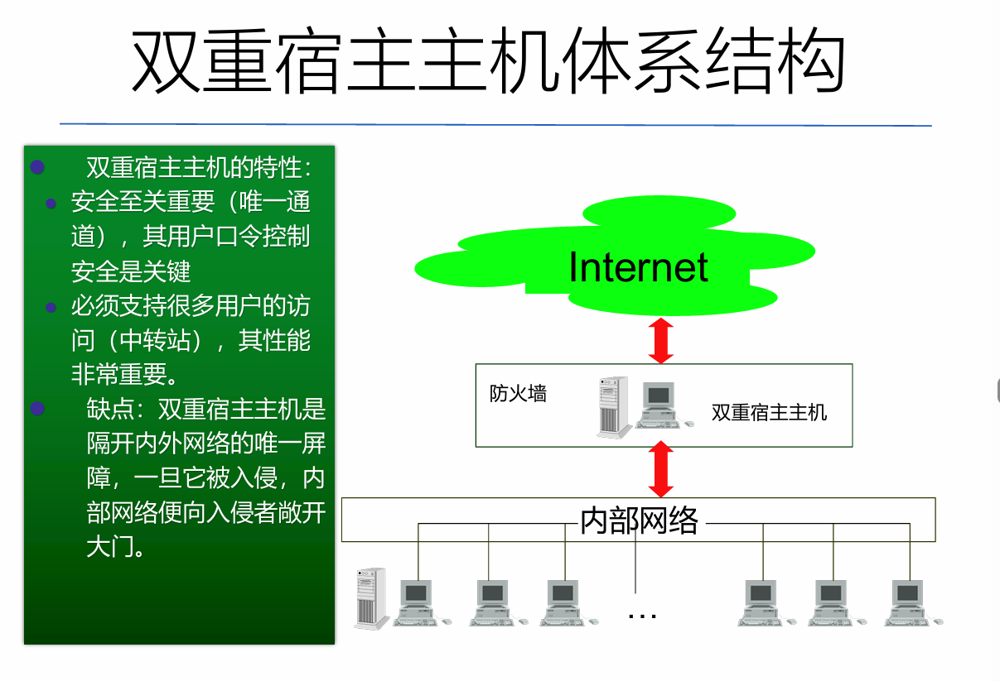
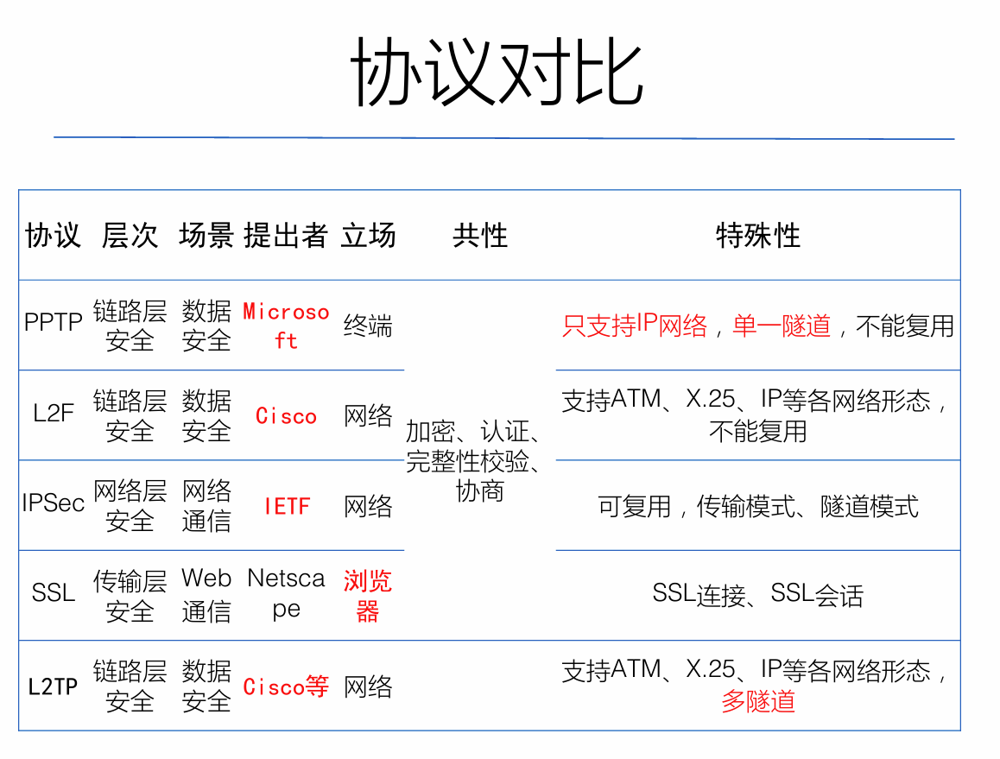

## 一、网络安全概述  

1. 信息保障阶段  
   1. **信息保障技术框架IATF**：由美国国家安全局制定，提出**“纵深防御策略”**， DiD(Defenese-in-Depth Strategy)  
   2. **PDRR模型**  
   3. P2DR模型：Policy,Protection,Detection,Response
2. **PDRR模型**：保护（Protection）、检测（Detection）、响应（Reaction）、恢复（Restore）  
   1. 保护：采取一切手段（主要指静态防护手段）保护信息系统的五大特性  
   2. 检测：检测本地网络的安全漏洞和存在的非法信息流，从而有效阻止网络攻击  
   3. 响应：对危及网络安全的事件和行为作出反应，阻止对信息系统的进一步破坏并使损失降到最低  
   4. 恢复：即使恢复系统 ，使其尽快正常对外提供服务，使降低网络攻击造成损失的有效途径  
3. 攻击类型：阻断攻击、截取攻击、篡改攻击、伪造攻击  
4. 网络信息安全按服务：
   1. **机密性服务**：提供信息的保密。  
   2. **完整性服务**：提供信息的正确性。
   3. **可用性服务**：提供的信息是可用的。
   4. **可审性服务**：本身不针对攻击提供保护，需与其他服务结合。  

## 二、网络攻击  

### 2.1 恶意代码  

 | 特性         | 病毒           | 蠕虫           | 木马               |
   | ------------ | -------------- | -------------- | ------------------ |
   | 传染性       | 强             | 很少           | 很少               |
   | 传播能力     | 强             | 极强           | 一般               |
   | 感染对象     | 文件           | 进程           | 进程               |
   | 主要传播方式 | 文件           | 网络           | 网络               |
   | 破坏性       | 强             | 强             | 很少               |
   | 隐蔽性       | 强             | 强             | 极强               |
   | 顽固性       | 较强           | 较强           | 极强               |
   | 欺骗性       | 一般           | 一般           | 强                 |
   | 主要攻击目的 | 破坏数据和信息 | 耗尽计算机资源 | 窃取信息、提供后门 |

### 2.2 ARP攻击  

- ARP协议：根据IP地址获取物理地址的一个TCP/IP协议  

- **ARP欺骗**：

  - ARP欺骗利用修改主机ARP缓存表的方法达到嗅探的目的，是一种中间人攻击。主机C为了达到嗅探的目的，会向主机A和主机B分别发送ARP应答包，告诉他们IP地址为IPB的主机MAC地址为MACC，IP地址为IPA的主机MAC地址为MACC   
  - 这样，主机A和主机B的ARP缓存中就会有IPB—MACC和IPA—MACC的记录。这样，主机A和主机B的通信数据都流向了主机C，主机C只要再发送到其真正的目的地就可以了。当然ARP缓存表项是动态更新的（一般为2min），如果没有更新信息，ARP映射项会自动删除。所以，主机C再监听过程中，还要不断向主机A和主机B发送伪造的ARP应答包。  

- **图，必须会画**：

  

### 2.3 拒绝服务攻击  

常见的攻击，及其原理如下：

- Ping of Death
  - 概述：向计算机发送畸形或恶意 ping
  - 原理：早期操作系统对ICMP分组只开辟64KB缓冲区；攻击者故意附加非常多的冗余信息，使数据包的尺寸超过65535字节；接收方处理时会出现内存分配错误，导致TCP/IP堆栈溢出；  
- **Teardrop**——！！重点关注！！：
  - 概述：Teardrop 指的是向目标机器发送损坏的IP包，诸如重叠的包或过大的包载荷，该攻击通过TCP/IP协议栈中分片重组代码中的bug来瘫痪各种不同的操作系统。 
  - **原理：**MTU（maximum transfer unit，最大传送单位）限制传输数据的包大小，大数据包需要分段。Teardrop攻击使接收数据方重组数据包时，出现数据包长度超大（如负值），导致溢出。(假设数据包中第二片IP包的 偏移量小于第一片结束的位移，而且算上第二片IP包的Data， 也未超过第一片的尾部，这就是重叠现象。）
- Land攻击  
  - 概述：利用特殊的TCP封包传送至目标主机，使其因无法判别而当机或被迫重新启动  
  - 原理：用一个特别打造的SYN包，它的源地址和目标地址都被设置成某一个服务器地址。此举将导致接收服务器向它自己的地址发送SYN-ACK消息，结果这个地址又发回ACK消息并创建一个空连接。被攻击的服务器每接收一个这样的连接都将保留，直到超时。  
- **SYN洪水**（标红，原理也标红）
  - **原理：**每个机器都需要为半开连接分配一定的资源，这种半开连接的数量是有限制的，攻击方利用TCP连接三次握手协议，打开大量的半开TCP连接，目标机器不能进一步接受TCP连接。机器就不再接受进来的连接请求  
  - 1.SYN 2.SYN+ACK 3.下一个SYN(本来应该是ACK)  
- **Smurf**（标红了，原理也标红）
  - **原理：**攻击者向一个广播地址发送ICMP Echo请求，并且用受害者的IP地址作为源地址，广播地址网络上的每台机器响应这些Echo请求，同时向受害者主机发送ICMP Echo-Reply应答，受害者主机会被这些大量的应答包淹没  
- **HTTP洪水**（只有名字标红了）
  - 占用大量的HTTP进程，从而耗费大量的系统资源。最终，会导致系统因不堪重负而崩溃掉  

## 三、web安全  

- XSS，跨站脚本攻击。是指通过**存在安全漏洞的Web网站**注册用户的浏览器内运行非法的HTML标签或JavaScript进行的一种攻击  
  - 非持久型XSS（反射型XSS）、存储型XSS（持久型XSS）、基于字符集的XSS、未经验证的跳转XSS  
- CSRF，跨站请求伪造攻击  

- SQL注入：通过**把SQL命令插入到Web表单递交或输入域名或页面请求的查询字符串**，最终达到欺骗服务器执行恶意的SQL命令  

## 四、DNS安全  

- 查询方式：**递归查询，迭代查询（反复查询）**  
- 安全威胁：1.只使用序列号来进行有效性鉴别；2.在DNS应答报文中可以附加信息；3.有缓存机制
- DNS欺骗：黑客将假的回答发送给客户端，使得真的回复被抛弃  
- DNS下毒：黑客将假的回答发送给DNS服务器，修改其cache

## 五、网络安全扫描  

- 端口扫描技术的**原理**：向目标主机的TCP/IP服务端口**发送**探测数据包，并**记录**目标主机的响应，通过**分析**响应来判断服务端口是打开还是关闭，即可得知端口提供的**服务或信息**。也可以通过捕获本地主机或服务器流入流出IP数据包来监视本地主机的运行情况，通过对接收到的数据进行分析，帮助我们发现目标主机的某些内在的弱点  
- **分类**：全连接扫描、半连接扫描、秘密扫描

## 六、防火墙  

*这肯定是重点*  

1. 访问控制的三个要素：主体、客体和控制策略  
   1. **主体S（Subject）**。是指提出访问资源具体请求。是某一操作动作的发起者，但不一定是动作的执行者，可能是某一用户，也可以是用户启动的进程、服务和设备等。  
   2. **客体O（Object）**。是指被访问资源的实体。所有可以被操作的信息、资源、对象都可以是客体。客体可以是信息、文件、记录等集合体，也可以是网络上硬件设施、无线通信中的终端，甚至可以包含另外一个客体。  
   3. **控制策略A（Attribution）**。是主体对客体的相关访问规则集合，即属性集合。访问策略体现了一种授权行为，也是客体对主体某些操作行为的默认。  
2. 访问控制策略的三原则：
   1. **最小特权原则**  主体执行操作时，按照主体所需权力最小化原则分配给它权力。
   2. **最小泄露原则**  主体执行任务时，按照主体所需要知道的信息最小化的原则分配给它权力。
   3. **多级安全策略**  主体和客体之间的数据流向和权限控制按照安全级别的 绝密（TS）、秘密（S）、机密（C）、限制（RS）和无级别（U）来划分  
3. 两种访问控制模型  
   1. 自主访问控制模型DAC：Discretionary Access Control Model  
   2. 强制访问控制模型MAC：Madatory Access Control Model，一种多级访问控制策略  
4. **防火墙**：
   1. 防火墙是位于两个（或多个）网络间实施网间访问控制的一组组件的集合  
   2. 满足的条件：
      1. 所有进出被保护网络的通信必须通过防火墙  
      2. 所有通过防火墙的通信必须经过安全策略的过滤或者防火墙的授权  
      3. 防火墙自身应对渗透免疫  
   3. **功能**：应用程序代理、访问控制、用户认证、VPN、日志、NAT、IDS与报警、内容过滤  
   4. **访问控制方法**：
      1. **服务控制：**确定可以访问的服务类型；  
      2. **方向控制：**确定特定的服务请求可以发起并允许通过防火墙；
      3. **用户控制：**不同的用户具有不同服务访问的权限；  
      4. **行为控制：**控制怎样使用特定服务。如过滤垃圾邮件；
   5. **分类**：
      1. 从形态上分类：软件防火墙、硬件防火墙  
      2. 从实现技术分类：包过滤防火墙，应用网关防火墙，代理 防火墙，状态检测防火墙，电路级网关  
      3. 从部署位置分类：主机防火墙，网络防火墙  

5. **网络地址翻译NAT**：

   1. 目的：1.解决IP地址空间不足的问题；2.向外界隐藏内部网结构  

6. **双重宿主主机体系结构**：防火墙体系结构

     

7. **屏蔽主机体系结构**  

   - 典型构成：**包过滤路由器+堡垒主机**  
   - 实现了网络层安全和应用层安全  

     

8. **屏蔽子网体系结构**：本质与屏蔽主机体系结构一样，但添加了一层额外保护体系——周边网络；堡垒主机位于周边网络上，周边网络和内部网络被内部路由器分开。  

     

   周边网络作用：即使堡垒主机被入侵者控制，它仍可以消除对内部网的侦听  

   堡垒主机：应用层网关；出站不一定经过；入站必须经过  

   外部路由器（访问路由器）作用：保护周边网络和内部网络不受外部网络的侵犯  

   内部路由器（阻塞路由器）作用：保护内部网络不受外部网络和周边网络的侵害，它执行大部分过滤工作  

   只对外通告DMZ区  

## 七、IDS  

1. **概念**(标红了)：入侵检测是从计算机网络或计算机系统中的若干关键点搜集信息并对其进行分析，从中发现网络或系统中是否有违反安全策略的行为和遭到袭击的迹象的一种机制  
2. **！！分类！！**：
   1. 根据原始数据的来源：
      1. 基于主机的入侵检测系统（HIDS）  
      2. 基于网络的入侵检测系统（NIDS）  
   2. 根据检测原理：
      1. 异常入侵检测  
      2. 误用入侵检测  
   3. 根据体系结构：
      1. 集中式  
      2. 等级式  
      3. 协作式  
   4. 根据工作方式分类  
      1. 离线检测  
      2. 在线检测  
3. **入侵检测结构 CIDF**：Common Intrusion Detection Framework  
   1. 事件产生器、事件分析器、响应单元、事件数据库  
   2.   
4. 入侵检测技术之 **异常检测技术、误用检测技术**  
   1. 异常检测技术：统计分析  【关键字：用户轮廓；偏离】Denning  
      1. 原理：正常行为的特征轮廓、检查系统的运行情况、是否偏离预设的门限
   2. 误用检测技术：专家系统（if-then)，模型推理；【关键字：预先定义入侵行为】
      1. 原理：通过某种方式预先定义入侵行为，然后对系统进行监视, 然后从中找出符合预定义规则的行为；
      2. Snort就是误用检测系统  

## 八、VPN  

1. 定义：是指依靠ISP或其他NSP在公用网络基础设施之上构建的专用的数据通信网络。不保护重放攻击；Denning没有误用记录  

2. 构成：VPN服务器--VPN连接（隧道）--VPN客户机  

3. **隧道协议内的协议**：乘客协议、封装协议、运载协议  

   1. | 运载协议 | 封装协议 | 乘客协议    |
      | -------- | -------- | ----------- |
      | IP头     | PPTP头   | PPP（数据） |

4. 分类：Client-LAN 和 LAN-LAN（采用IPSec）  

5. **功能**：**数据机密性保护、数据完整性保护、数据源身份认证、重放攻击保护**  

6. PPTP、L2TP、L2F：第二层隧道（第三层隧道：IPSec）  

   1. 位于数据链路层

7. 协议对比：  

8. **IPSec**：  

   1. 体系结构
   2. **AH：传输模式、隧道模式**  身份认证、数据完整性校验、重放攻击保护；不保证机密性  
      1. 传输模式 ：经IPsec处理后由 IP头部 | 负载 —> IP头部 | AH 头部 | 负载 （添加了AH头部）   
      2. 隧道模式：经IPSec处理后由 IP头部 | 负载 —> 新IP头 | AH 头 |IP头 | 负载 （新IP头中源IP和目的IP分别是VPN网关1、2）  
      3. 从最前面的IP到负载结束 都是认证部分（AH头前的IP可变字段除外）
   3. **ESP：传输模式、隧道模式**  身份认证、数据加密、数据完整性校验、重放攻击保护
      1. 传输模式：经IPSec处理后从 IP头部 | 负载 —> IP头 | ESP头 | 负载 |ESP尾 | ESP认证  
      2. 隧道模式：经IPSec处理后从 IP头 | 负载 —> 新IP头 | ESP头 | IP头 |负载 |ESP尾 | ESP认证  
      3. 从ESP头（区别AH从IP头）到ESP尾（不包括认证）是认证部分  
      4. 负载|ESP尾 是加密部分  
      5. 传输模式保护主机间的连接，隧道模式保护网络间的连接
   4. **SA（安全联盟）**：规定通信双方使用哪种IPSec协议（首先是IKE SA，然后是IPSec SA）  
   5. **IKE**：互联网密钥交换  
      1. 作用：就是建立安全联盟  
      2. **密钥交换的两个阶段**：
         1. 阶段一交换：两个IKE实体建立一个安全的，经验证的信道进行后续通信；**可用身份保护模式（主模式）或野蛮模式**  
         1. 阶段二交换：在阶段一建立的信道中，为某种进程协商和产生密钥材料和安全参数，比如在VPN 中就是 **建立IPSec安全联盟**；快速模式  
      3. 主模式和野蛮模式的**区别：**野蛮模式只用到主模式一半的消息，因此它的协商能力受到限制，而且它不提供身份保护  
      4. 阶段一的**三个步骤**：SA交换、密钥交换、ID及验证交换  
         1. 主模式：提供身份保护机制，三步骤6消息；①策略协商交换②Diffie Hellman共享值、nonce交换 ③身份验证交换  
         2. 野蛮模式：3条消息；头两条协商策略，交换DH值和辅助数据以及身份信息；第二条认证响应方；第三条认证发起方，并为发起方提供在场证据。
      5. 阶段二交换：三步骤，三信息 Z字形，前两认证，第三个证明活性 
   6. **SSL协议** Secure Socket Layer
      1. 位于TCP层之上，提供保密性和身份认证、数据完整性  
      2. **底层：SSL记录协议；上层：SSL握手协议、SSL密码变化协议、SSL警告协议**  
      3. **封装过程**  
         1. 第一步，分片  214字节或更小
         2. 第二步，压缩（可选）必须是无损压缩  
         3. 第三步，计算MAC  
         4. 第四步，加密——采用CBC  
      4. 整体流程  
         1. 交换Hello消息，对于算法、交换随机值等协商一致  
         2. 交换必要的密码参数，以便双方的到统一的premaster secret  
         3. 交换证书和相应的密码信息以便进行身份认证  
         4. 产生master secret  
         5. 把安全参数提供给TLS记录层  
         6. 检验双方是否已获得同样的安全参数

## 九、PGP！  

1. 为**电子邮件和文件存储**应用提供了认证和保密性服务  

2. 数字签名和消息加密的具体过程  

   1. 数字签名/身份认证：发送方对消息M产生散列码H，用私钥加密与M连接；接收方用公钥解密恢复H，计算M的H，比较；散列码用SHA-1，加密用RSA。  
   2. 保密性：生成消息M和会话密钥（随机数），用会话密钥加密M，用接收者的公钥加密会话密钥，与M结合；接收者恢复会话密钥，然后恢复消息；  使用CAST-128加密报文，使用RSA加密会话密钥；会话密钥可以使用DH
   3. 保密+认证：先用自己的私钥签名，然后用会话密钥加密，再用接收者的公钥加密会话密钥；签名->压缩->加密

3. 使用了哪四种类型的密钥？分别用来做什么  

   1. 一次性会话密钥、公钥、私钥、基于口令短语的传统密钥；

4. 私钥环和公钥环分别用来做什么  

   1. 私钥环：存储本节点拥有的公私钥对；  
      1. 时间戳、KeyID、公钥、私钥、UserID  
   2. 公钥环：存储本节点所知道的其他用户的公钥  
      1. 时间戳、KeyID、公钥、对所有这信任度、用户ID、密钥合法度、签名、对签名者的信任度  
      2. 可以用KeyID 或 UserID索引

5. **PGP私钥环如何保存**  
   1. 用户选择一个口令短语用于加密私钥  

   2. 当系统用RSA生成一个新的公私钥对时，要求用户输入口令短语。对该短语使用SHA-1生成160位散列码后销毁该短语  

   3. 用其中的128位作为密钥用CAST-128加密私钥，然后销毁散列码，将加密后的私钥存储到密钥环中  

   4. 用户要访问私钥时，提供口令短语。PGP将取出加密后的私钥，生成散列码，解密私钥

6. **邮件数据处理的过程**  

   1. 顺序：签名——压缩——加密  

   2. **签名后压缩原因**：①不需要为校验签名而保留压缩版本的消息②为了检验而再做压缩不能保证一致性，压缩算法的不同实现版本可能会产生不同的结果  

   3. **压缩后加密的原因：**压缩后消息冗余小，增加分析难度；先加密压缩难以见效  

   4. **发送方处理过程**：

      1. 签名  

         1. 从私钥环得到私钥，利用userid作为索引  
         2. PGP提示输入口令短语，恢复私钥  
         3. 构造签名部分  

      2. 加密：  

         1. PGP产生一个会话密钥，并加密消息  
         2. PGP用接收者userid从公钥环中获取其公钥  
         3. 构造消息的会话密钥部分  
   5. **接收方处理过程**：
      1. 解密消息  
         1. PGP用消息的会话密钥部分中的KeyID作为索引，从私钥环中获取私钥  
         2. PGP提示输入口令短语，恢复私钥  
         3. PGP恢复会话密钥，并解密消息  
      2. 验证消息  
         1. PGP用消息签名部分KeyID 作为索引，从公钥环中获取发送者的公钥  
         2. PGP恢复被传送过来的消息摘要  
         3. PGP对接收到的消息作摘要，并与上一步的结果作比较

