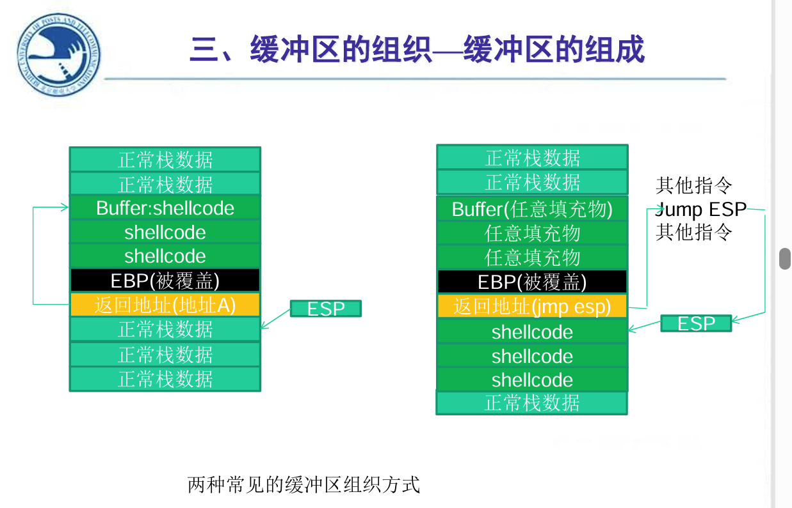
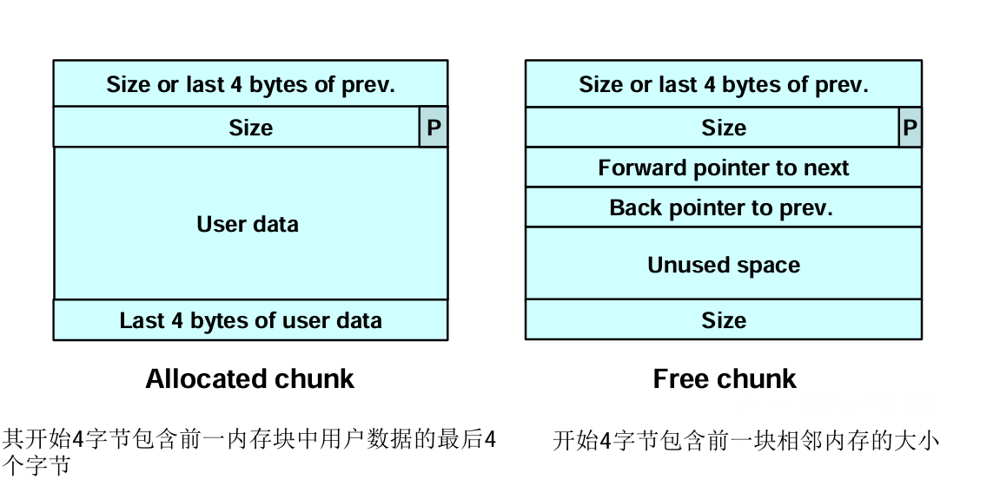
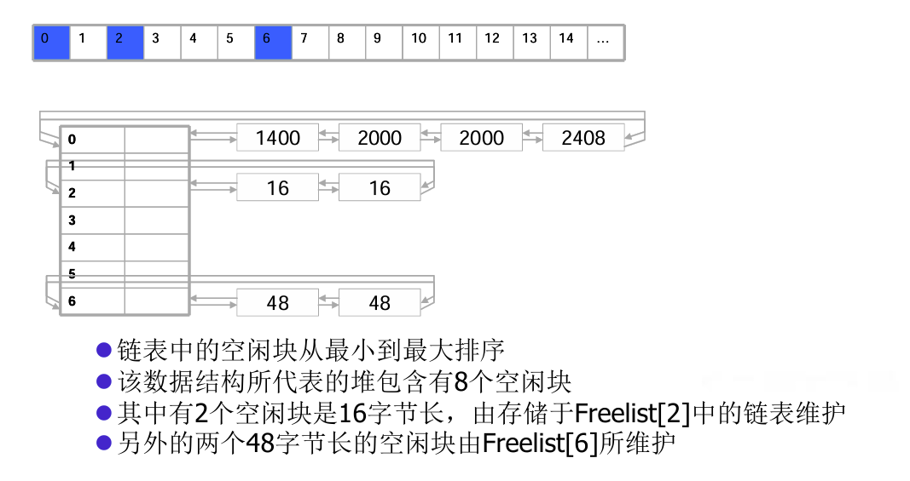

## 2. 缓冲区溢出基础  

### 2.1 缓冲区溢出原理

缓冲区溢出是指当计算机向缓冲区内填充数据位数时超过了缓冲区本身的容量溢出的数据覆盖在合法数据上  

### 2.2 进程内存空间分区

- 虚拟内存地址(VA)=装载基址(Image Base)+相对虚拟地址(RVA)  
- PE文件中以0x200字节为基本单位，内存中以0x1000字节为基本单位  
- .data节 .rdata节 .text节 文件头、节表等（底部是装载基址）
- 文件偏移地址=VA - 装载基址 - 节偏移
  - 节偏移 = RVA- 文件偏移量  

### 2.3 系统栈的工作原理—内存的不同用途  

| 名称   | 用途                                                         |
| ------ | ------------------------------------------------------------ |
| 代码区 | 这个区域存储着被装入执行的二进制机器代码，处理器会到这个区域取指并执行 |
| 数据区 | 用于存储全局变量等                                           |
| 堆区   | 进程可以在堆区动态地请求一定大小的内存，并在用完后归还给堆区。动态分配和回收是堆区的特点 |
| 栈区   | 用于动态地存储函数之间的调用关系，以保证被调用函数在返回时恢复到父函数中继续执行 |

### 2.4 函数栈帧、函数调用原理  

- 调用步骤：
  1. 参数入栈  
  2. 返回地址入栈（当前指令的下一条指令地址）  
  3. 代码区跳转  
  4. 栈帧调整（EBP入栈，ESP值装入EBP(mov ebp,esp) ，ESP减去空间大小）
- EBP的下一个地址就是返回地址  

## 3. 字符串安全  

### 3.1 常见的字符串操作错误  

- 无界字符串复制、空结尾错误、截断、差一错误、数组写入越界、不恰当的数据处理

### 3.2 不安全字符串API  

- strcpy()-> strncpy()
- gets()->fgets()
- sprintf()->snprintf()
- strcat()  
- scanf()

### 3.3 字符串问题导致的安全漏洞  

- 缓冲区溢出、程序栈、弧注入、代码注入

| 信息       | 功能                                                         |
| ---------- | ------------------------------------------------------------ |
| 缓冲区溢出 | 向为某特定数据结构分配的内存空间边界之外写入数据             |
| 程序栈     | 栈可以通过存储特定内容来追踪程序的执行和状态。               |
| 弧注入     | 将控制转移到已经存在于程序内存空间中的代码中                 |
| 代码注入   | 攻击者创建一个恶意参数（被合法接受，导致漏洞代码路径执行，在执行前不能导致程序非正常终止），当函数返回时，控制被转移到恶意代码 |

### 3.4 缓解与防范措施  

- 缓解措施：
  - **预防**缓冲区溢出
  - **侦测**缓冲区溢出并安全地恢复，使得漏洞利用的企图无法得逞  
- 防范策略：
  - **静态**分配空间：输入验证、strlcpy()、strlcat()  
  - **动态**分配空间：不会丢弃多余数据，但可能导致拒绝服务攻击  

## 4. 软件漏洞基础  

### 4.1 软件漏洞的概念  

- 能够引起软件做一些“超出设计范围的事情”的bug称为漏洞

- 是安全性逻辑缺陷， 通常情况下不影响软件的正常功能， 但被攻击者成功利用后，有可能引起 软件去执行额外的 恶意代码。

### 4.2 软件漏洞的危害  

- 无法正常使用、引发恶性事件、关键数据丢失、秘密信息泄露、被安装木马病毒  

### 4.3 软件漏洞出现的原因  

- 小作坊式的软件开发、赶进度带来的弊端、被轻视的软件安全测试、淡薄的安全思想、不完善的安全维护  

## 5. 漏洞技术  

### 5.1 Shellcode 与 exploit 的概念  

- Shellcode：缓冲区溢出攻击中植入进程的代码  
- exploit：代码的植入过程就是漏洞利用，即exploit  

### 5.2 栈帧移位与 jmp esp  

- 栈帧移位：静态的shellcode地址不能适应动态的内存变化  
- jmp esp：利用一条jmp esp指令的**地址**覆盖函数返回地址，后面接上shellcode（填充+jmp esp+shellcode)  

### 5.3 缓冲区的组成  

-   

## 6 漏洞挖掘与模糊测试  

### 6.1 fuzz测试的概念与主要目标  

- Fuzz 测试就是利用不断地向目标程序发送或传递不同格式的数据来测试目标程序的反应
- Fuzz 的主要目的是“崩溃crash” “中断break” “销毁destroy”  

### 6.2 文件格式 fuzz 测试的主要步骤  

1. 以一个正常的文件模板作为基础，按照一定的规则产生一批畸形文件  
2. 将畸形文件逐一送入软件进行解析，并监视软件是否会抛出异常  
3. 记录软件产生的错误信息，如寄存器状态、栈状态等  
4. 用日志或其他UI形式向测试人员展示异常信息，以进一步鉴定这些错误能否被利用

### 6.3 Smart fuzz 的主要特征  

1. 面向逻辑(Logic Oriented Fuzzing)：测试前首先明确要测试的目标是解析文件的程序逻辑，而不是文件本身  
2. 面向数据类型(Data Type Oriented Fuzzing)：数据类型有算数型、指针型、字符串型、特殊字符  
3. 基于样本(Sample Based Fuzzing)：对模板文件每次只改动一小部分数据和逻辑来生成畸形文件  

## 7 指针安全  

### 7.1 基本概念  

- 指针安全是指通过修改指针值来利用程序漏洞的方法 的统称  
  - 可以通过覆盖函数指针将程序的控制权转移到攻击者提供的shellcode  
  - 对象指针也可以被修改，从而执行任意代码  
- 条件：
  - 缓冲区与目标指针必须分配在同一个段内  
  - 缓冲区必须位于比目标指针更低内存地址处  
  - 该缓冲区必须是界限不充分的


### 7.2 修改指令指针  

- 通过函数指针的调用是间接引用  
  - IC的下一个值，存储在内存中，可以被改变

### 7.3 内存任意写技术  

- “任意内存写”可以改变程序控制流  
- 如果指针长度等于重要的数据结构长度，任意内存写会更容易  
  - Intel 32 : `sizeof(void*)=sizeof(int)=sizeof(long)=4B`  

### 7.4 虚函数  

- 虚函数和虚表的要点  
  - C++类的成员函数在声明时，若使用关键字virtual进行修饰，则被称为虚函数  
  - 一个类中可能有多个虚函数  
  - 虚函数的入口地址被统一保存在**虚表**中  
  - 对象在使用虚函数时，先通过虚表指针找到虚表，然后从虚表中取出最终的函数入口地址进行调用  
  - 虚表指针保存在**对象的内存空间中**，紧接着虚表指针的是其他成员变量  
  - 虚函数只有通过对象指针的引用才能显示出其动态调用的特性

### 7.5 SEH  

- SEH结构体中包含两个DOWRD指针：链表指针、异常处理函数指针（共8字节，每个4字节）  
- 实验中就是覆盖了异常处理函数指针

### 7.6 Windows 内存安全机制：GS编译、DEP、Heap cookie、Safe Unlink、ASLR  

1. GS编译技术，在函数返回地址前首先检测Security Cookie是否被覆盖，从而把针对操作系统的栈溢出变得非常困难  
2. DEP（Data Execution Protection，数据执行保护）将数据部分标识为不可执行，阻止了栈、堆和数据节中攻击代码的执行  
3. Heap Cookie：类似栈中的Security cookie  
4. Safe Unlink：unlink前会对块的前后向指针进行验证，必须指向同一块  
5. ASLR（Address space layout randomization，加载地址随机）通过对系统关键地址的随机化，使得经典堆栈溢出手段失效  

## 8 格式化输出  

### 8.1 格式化输出函数原理  

- 格式化输出函数参数由一个格式字符串和可变数目的参数构成  
  - 格式化字符串提供了一组可以由格式化输出函数解释执行的指令  
  - 用户可以通过控制格式字符串内容来控制格式化输出函数的执行  

### 8.2 典型的格式化输出函数和格式化符  

- `fprintf()——写入流, printf()——假定输出流stdout, sprintf()——写入数组`  
- `snprintf(),vprintf(),vsprintf(),vsnprintf()`  

### 8.3 格式化输出函数可能导致的安全问题  

- 当使用的格式字符串是由用户或其他非信任来源提供的时候，就有可能出现格式字符串漏洞  
- 当格式化输出例程对一个数据结构进行越界写时就可能会导致缓冲区溢出  
- `sprintf(buffer, "Wrong command: %s\n", user)`，大于495字节的字符串会越界：(512-16字符-1空字节)

### 8.4 可扩展的缓冲区  

不做边界检查的话，将溢出，可以覆盖

### 8.5 使程序崩溃  

- 在UNIX系统中，存取无效的指针会引起进程收到SIGSEGV信号，若不捕捉并处理，会导致程序非正常终止，核心转储  
- 与之类似，在Windows中读取一个未映射的地址将会导致系统 的一般保护错误并导致程序非正常终止。
- 比如 `printf("%s%s%s%s%s%s%s%s%s%s%s%s%s%s%s%s%s%s");` 会触发无效指针存取或未映射的地址读取

### 8.6 覆写内存  

- 使用 `%n` 覆写内存  

- `printf("\xdc\xf5\x42\x01%08x.%08x.%08x%n”);`  

- 用于覆写一个地址的代码：

```c
static unsigned int already_written,width_field;
static unsigned int write_byte;
static char buffer[256];

already_written = 506;
//first byte
wirte_byte = 0x3c8;
already_wirtten %= 0x100;

width_field = (wirte_byte - already_wirtten) % 0x100;
if (width_field < 10) width_field +=0x100;
sprintf(buffer, "%%%du%%n",width_field);
strcat(format, buffer);
//后面的类似
```

- wirte_byte：下一个将要写入的字节值  
- already_wirtten 输出字符个数  
- 需要的宽度  


完整步骤：

```c
unsigned char exploit[1024]= "...\x90";
char format[1024];

strcpy(format,"\xaa\xaa\xaa\xaa");
strcat(format,"\xdc\xf5\x42\x01");
strcat(format,"\xaa\xaa\xaa\xaa");
strcat(format,"\xdd\xf5\x42\x01");
strcat(format,"\xaa\xaa\xaa\xaa");
strcat(format,"\xde\xf5\x42\x01");
strcat(format,"\xaa\xaa\xaa\xaa");
strcat(format,"\xdf\xf5\x42\x01");

for (i=0; i<61; i++){
    strcat(format, "%x");
}

//前面的地址代码  

printf(format);
```

### 8.7 缓解与防范措施  

- 动态格式字符串
- 限制字节写入（%.495s)  
- 增强安全性的函数（_s后缀如printf_s(), 不支持%n)  


- 为了消除格式字符串漏洞，推荐在可能的情况下使用iostream 代替stdio ，在没有条件的情况下则要尽量使用静态格式字符串  
- 当需要动态字符串的时候，最关键的是不要将来自非信任源的 输入合并到格式字符串中。  

## 9 整数安全  

### 9.1 整数表示方法：原码、反码、补码  

- 原码：最高位0正1负，低位表示大小
- 反码：正数本身；负数符号位不变，其余按位取反
- 补码：负数是反码+1；0只有+0一种表示；正数不变

### 9.2 带符号和无符号整数  

- 带符号：正值和负值  
  - 在一个使用补码表示法的计算机上，带符号整数的取值范围是$-2^{n-1}$ 到$2^{n-1}-1$  (-256到255)
- 无符号：最大值$2^n-1$

### 9.3 整数取值范围  

- signed char:$-2^7到2^7-1$​  
- unsigned char: 0-255  
- short: $-2^{15}到2^{15}-1$  
- unsigned short: 0-65535

### 9.4 整数转换、整数提升、隐式转换  

- 整型提升：在比int小的整型进行操作时，它们会被提升。
  - 如果原始类型的所有值都可以用int表示，较小的类型会被转换成一个int，否则被转换成一个unsigned int  
  - 比如两个char 相加，会被提升至int，计算结果会被截断以适应char
- 隐式转换是C语言可以对混合数据类型执行操作能力的结果

### 9.5 整数转换规则  

- 越长的等级越高，无符号的和对应的有符号的相同等级  
- 从无符号转换：
  - 较小的到较大的，总是安全的，进行0扩展  
  - 较大的到较小的，较大的会被截断，低位保留  
  - 从无符号到对应的有符号，所有的位数据会保留，最高位数据成为符号位  
- 从带符号转换：
  - 相同大小/更大的无符号，值不变，带符号整数需做符号扩展  
  - 转到较短的带符号，高位截断  

### 9.6 整数溢出类别及原理：整数溢出、截断错误、符号错误  

- 整数溢出：
  - 一个整数被增加超过其最大值或减小小于最小值时会发生整数溢出  
  - 带不带符号都可能发生溢出  
- 截断错误：
  - 将较大整形转换到较小整型且超过了较小的表示范围  
  - 高位截断丢弃  
- 符号错误：
  - 无符号到带符号，相同大小下数据不变，最高位会变成符号位；更大会扩展，更小会保留低位  
  - 带符号到无符号，大小关系同上；另外，负的会变成很大的正的  


- 检查：范围检查；测试

## 10 动态内存安全  

### 10.1 动态内存管理函数  

- C下：
  - `calloc(size_t nmemb,size_t size)`为数组分配内存共nmemb元素每个元素size字节 、`malloc()`、`realloc()`  
  - `free()`  
- C++  
  - `new()`  
  - `delete()`  

### 10.2 内存分配算法  

- 连续匹配方法：查询匹配的第一个空闲区域  
- 最先匹配：从内存开始位置寻找第一个空闲区域  
- 最佳匹配：有m个字节的区域被选中，其中m是可用的最小的等于或大于n个字节的连续存储的块  
- 伙伴系统方法  
- 隔离：保持单独的大小一致的块的列表

### 10.3 常见的内存错误  

- 初始化错误：假设malloc()分配的内存是0；必须用memset()或calloc();
- 未检查返回值：可能会返回空指针
- 引用已释放内存：比如释放时没用临时变量  
- 对同一块内存释放多次  
- 不正确配对的内存管理函数  
- 未能区分标量和数组  new<->delete;new[]<->delete[]
- 分配函数使用不当 malloc(0)

### 10.4 Dlmalloc 空闲块管理  

结构如下：  

- 块大小总是偶数，所以最后一位用于PREV_INUSE表示是否分配 1表示已分配
- free时，内存块的合并条件：
  - 上一块为空闲块，合并  
  - 下一块为空闲块，也从双链表中解开，并与被释放块合并

### 10.5 解链技术（unlink） 

- free时判断第二块是否空闲  
  - 看第三块PREV_INUSE内容  
  - 通过第二块大小来找第三块  

```c
#define unlink(P,BK,FD){
	FD = P->fd;
	BK = P->bk;
	FD->bk = BK;
	BK->fd = FD;
}
```


- 逻辑是这样的：
  - 通过构造让第二块被误认为第三块，从而使第二块被unlink来与第一块合并  
  - 而第二块被精心构造的参数所覆盖，其中fd指针指向了FUNCTION_POINTER-12的位置，bk指针指向了CODE_ADDRESS  
  - 到unlink宏第三行时，FUNCTION-12 +12的位置刚好是FD->bk，所以被改写为bk指针指向的CODE_ADDRESS  
  - 于是就成功向任意地址写入4字节数据

### 10.6 Frontlink 技术  

- 一块内存被释放时，它必须被正确地链接进双链表中

- 使攻击者指定的地址写入攻击者指定的数据  

  - 指定一个内存块的地址，而不是shellcode的地址  
  - 在这个内存块的起始4个字节中放入可执行代码  
  - 通过往上一内存块的最后4个字节中写入指令实现的
  
  ```c
  BK = bin;
  FD = BK->fd;
  if (FD != BK ){
      while (FD!=BK && S<chunksize(FD)){
          FD = FD -> fd;
      }
      BK = FD->bk;
  }
  P->bk = BK;
  P->fd = FD;
  FD->bk = BK->fd = P;
  ```


函数指针值-8就是函数指针的地址

- 逻辑是这样的：
  - fifth块比second块大8  
  - 释放fifth，然后forth块溢出，修改**fifth块**前向指针指向假内存块  
    - 假内存块的后向指针位置(内存块+12)含有一个函数指针的地址（函数指针减8）  
    - 一个合适的函数指针是存储在程序.dtors区中的第一个析构函数的地址  
  - 释放second块，frontlink()使得second与fifth插入到相同的筐中  
    - fifth块的前向指针存储到FD中  
    - 假内存块的后向指针存储到BK中
  - BK包含函数指针的地址，BK->fd(BK+8)也就是函数指针被赋值为 P

### 10.7 RTL 堆基本概念  

- RTL:Run Time  Library  
  - 使用虚拟内存API  
  - 实现了跟高级的局部、全局和CRT内存函数

- RTL 数据结构：
  - 进程环境块(PEB) : 维护每一个进程的全局变量  
    - 被每一个进程的线程环境块(TEB)引用  
    - TEB被fs寄存器引用  
    - PEB给出堆数据结构的信息：
      - 堆的最大数量  
      - 堆的实际数量  
      - 默认堆的位置  
      - 一个指向包含所有堆位置的数组的指针
  - 空闲链表、look-aside链表  
    - 空闲链表：有128个双向链表的数组  
    -   
    - 
  - 内存块的结构

- 边界标志：
  - 调用`HeapAlloc()`或`malloc()`返回的  
  - 位于`HeapAlloc()`返回的地址之前，偏移8字节  
  - 包含：
    - 自身大小
    - 前一块大小  
    - busy标志位  
    - 传统部分  
- 块被释放时：
  - 边界标志仍然存在  
  - 空闲内存包含上一块和下一块地址  
  - busy标志位被清空

